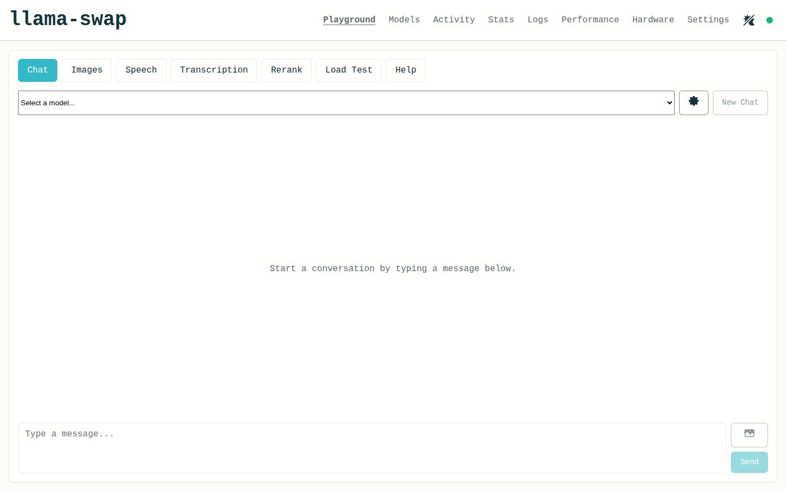
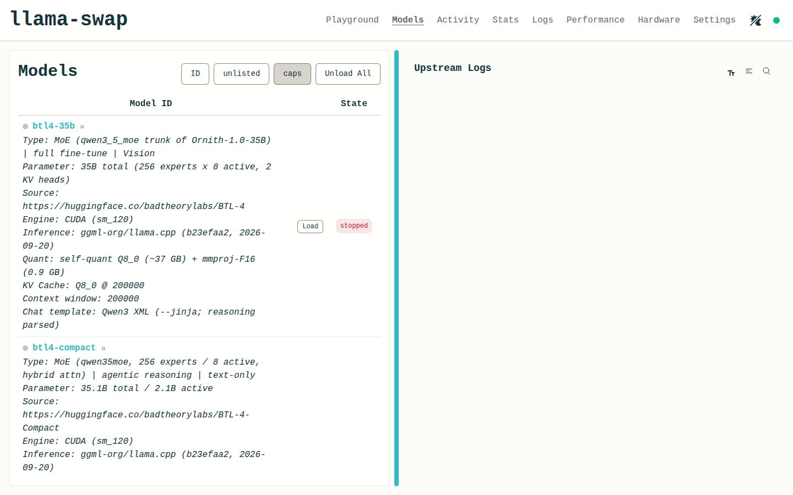
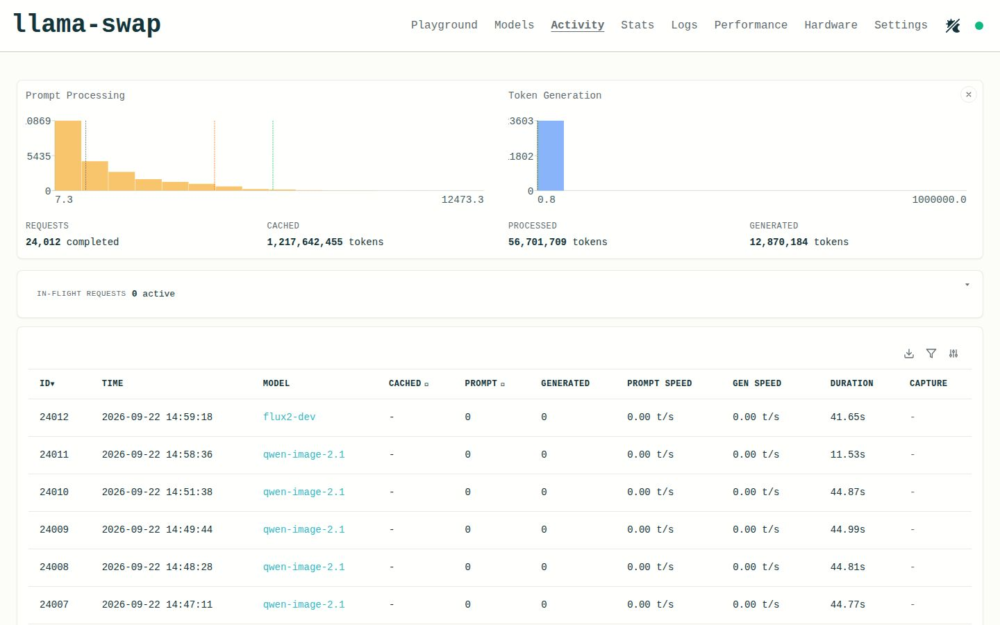
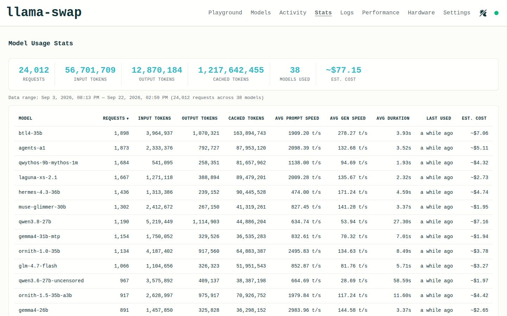
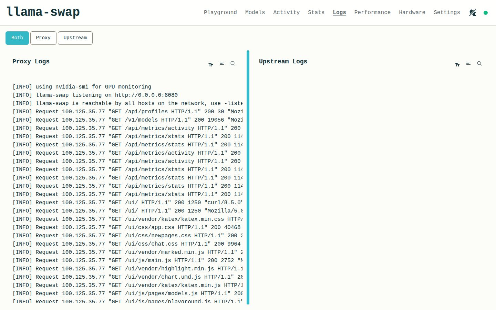
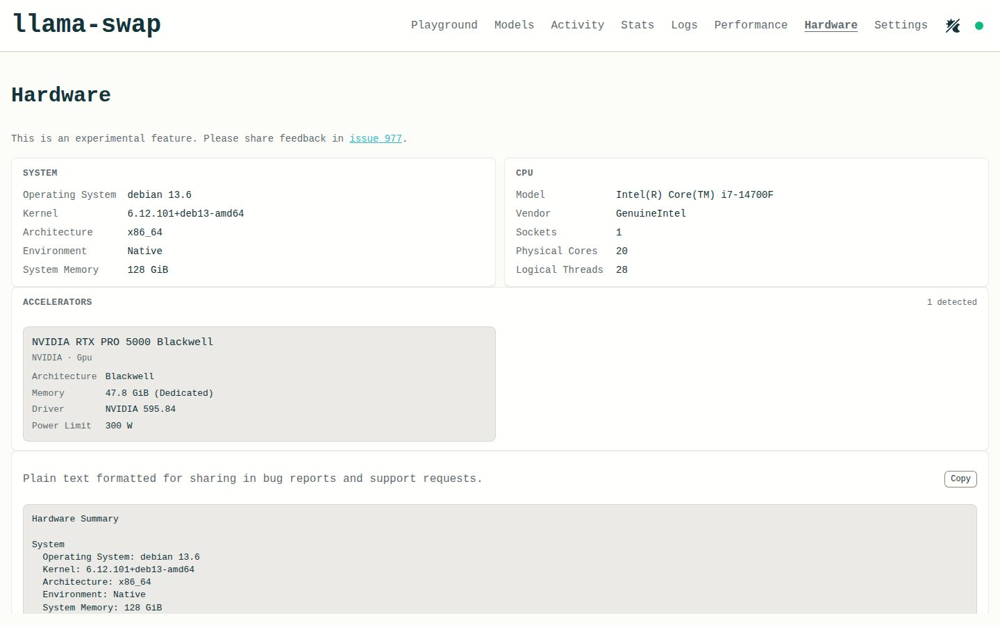

# llama-swap (anant's fork)

A personal fork of [llama-swap](https://github.com/mostlygeek/llama-swap) maintained by
[Anant Shrivastava](https://github.com/anantshri) to run his own local inference setup.

**If you are looking for llama-swap, use the upstream project:**
<https://github.com/mostlygeek/llama-swap>. That is the stable, documented, supported
version, with releases, container images, and package-manager installs.

This fork is maintained for Anant's own usage. It is **not guaranteed to work for anyone
else** and is not looked after with other users in mind. The code is public for
reference; issues and pull requests are welcome but may sit untouched.

## Relationship to upstream

- Divergence baseline: upstream `7a14664` (2026-08-31). Since then this fork has
  diverged drastically — the full list is below.
- **Going forward, upstream changes are adopted by cherry-picking** selected commits
  and adapting them. The fork does not track or merge upstream main.
- The upstream README is preserved at [README.original.md](README.original.md).
  Everything not listed below — installation channels (Docker, Homebrew, MacPorts,
  WinGet, release binaries), the full configuration reference, nginx reverse-proxy
  setup, CLI log streaming — works as documented there.
- This fork's changes are tracked in [CHANGELOG.md](CHANGELOG.md) (summary) and
  [DETAILED_CHANGELOG.md](DETAILED_CHANGELOG.md) (long-form, with verification).

## What this fork changes

### API translation layers

- **Ollama-compatible API** — `POST /api/chat`, `POST /api/generate`,
  `POST /api/embed`, `POST /api/embeddings`, `GET /api/tags`, `POST /api/show`,
  `GET /api/ps`, translated to OpenAI shape and back (streaming and buffered);
  `HEAD /` returns `200` for client reachability probes; model-management endpoints
  return *not implemented*. `passthroughOllama: true` forwards requests unchanged.
- **Anthropic Messages API** — `/v1/messages` translated to OpenAI
  `v1/chat/completions` and responses translated back; `/v1/messages/count_tokens`
  is a raw pass-through. `passthroughAnthropic: true` forwards unchanged.

### Web UI (no npm)

- The Svelte/npm UI is replaced by hand-authored vanilla ES-module JavaScript
  committed under `internal/server/ui_dist/` and embedded via `//go:embed`.
  Building requires only Go — no Node.js build step.
- All upstream UI features are ported: activity table, profiles & selectors, model
  detail pages, hardware page, Load Test tab, Help/docs agent.
- Fork-only UI features:
  - Models page: filter box (id / name / alias / description, peer groups included),
    model descriptions collapsed by default with expand toggle
  - Capability-aware model pickers: Images/Audio/Speech/Rerank tabs list only models
    that fit the tab, with a "show all" toggle
  - Stats page: split into Active Models (still configured) and Inactive Models
    (usage history for removed/renamed ones)
  - Logs: per-panel "concerns" filter (WARN / ERROR / FATAL / PANIC / 4xx / 5xx),
    ANSI-colored output, regex filter, resizable panes
  - Chat: live per-turn token/speed stats, responsive settings panel with
    `top_k`/`top_p`/`min_p`, collapsible Work section per response

### Activity & metrics storage

- sqlite-backed activity store: paginated activity log, request/response captures
  with a **Parts view** (per-message token/word/CJK-aware estimates), pinnable
  captures, client-source (IP/forwarded-header) tracking
- Server-side aggregate stats, sortable stats table, estimated cost with per-model
  pricing, INR currency option, compact number display

### Hardware & GPU monitoring

- Intel GPU detection: xpu-smi probing, PCI device-ID tables (Alchemist/Battlemage
  naming), DRM sysfs probing, macOS Metal family/version reporting
- **sysfs GPU stats provider** (`internal/perf/monitor_sysfs.go`): reads hwmon and
  DRM fdinfo directly, so hosts without `nvidia-smi`/`rocm-smi`/LACT (Intel `xe`/
  `i915`, and others) still get GPU telemetry in `/metrics` and the UI. Sensor reads
  are throttled and skipped while idle so runtime-suspended cards stay asleep;
  failed reads are retried and last-known values carried so charts don't dip to zero.

### Proxy & configuration features

- `globalConcurrencyLimit` — cap concurrent inference requests across all models
- Automatic capability discovery (`capcompat`): asks the upstream what it supports
  when a model becomes ready, caches it, advertises it via `/v1/models`
- `setParams`/`setParamsByID` keys ending in `?` are set-if-undefined;
  `setParamsByMatch` conditional filters; per-model output-token caps;
  matrix `+undefined` reference
- `POST /models/unload` — llama.cpp-compatible named unload used by Open WebUI
- Configurable CORS controls; forwarded-header client tracking in activity records

### Documentation & tooling

- `/api/mcp` — llama-swap's own documentation as MCP tools (used by the Playground's
  Help agent and any MCP client); jq-backed config queries
- Indexed reference docs served to the docs agent
- `make gosec` reports zero findings across linux/darwin/windows; every suppression
  is a reviewed false positive documented in
  [docs/gosec-suppressions.md](docs/gosec-suppressions.md)

## Screenshots

Playground (chat, images, speech, transcription, rerank, load test, help):



Models page with load/unload, states, and model descriptions:



Activity log with token metrics and captures:



Aggregate usage stats:



Log viewer:



Hardware detection:



## Building from source

Requires Go only (the web UI has no build step):

```shell
git clone https://github.com/anantshri/llama-swap.git
cd llama-swap
make clean all
# binary in build/
```

Useful targets: `make test-dev` (go test + staticcheck), `make test-all`
(adds `-race` and long-running concurrency tests), `make gosec` (security scan).

## Configuration

Same as upstream — see [README.original.md](README.original.md) and
[docs/config.example.yaml](docs/config.example.yaml). Minimum config:

```yaml
models:
  model1:
    cmd: llama-server --port ${PORT} --model /path/to/model.gguf
```
